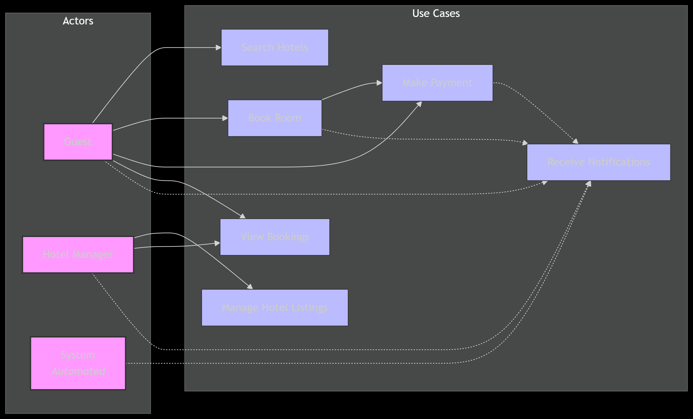

# requirement-analysis
Requirement Analysis in Software Development.

# Requirement Analysis in Software Development

This repository is dedicated to the study and practice of Requirement Analysis in Software Development. 

The purpose of this repository is to provide a structured space to document, share, and explore requirement gathering techniques, analysis methods, and best practices that ensure software projects meet user needs and business objectives.

## What is Requirement Analysis?

Requirement Analysis is the process of identifying, documenting, and managing the needs and expectations of stakeholders for a software project. It involves understanding what users and clients want the software to achieve, the functionalities it should provide, and any constraints or limitations that must be considered.

### Importance in the Software Development Lifecycle (SDLC)

- **Foundation for Development:** Requirement analysis provides a clear roadmap for designers and developers, reducing ambiguity and minimizing errors.
- **Stakeholder Alignment:** Ensures that the software aligns with business goals and user expectations.
- **Cost and Time Efficiency:** Identifying requirements early helps prevent costly changes and rework during later stages.
- **Quality Assurance:** Well-defined requirements make it easier to create test plans and validate that the final product meets expectations.
- **Risk Management:** Helps identify potential challenges and risks early, allowing for proactive mitigation strategies.
  

## Why is Requirement Analysis Important?

Requirement Analysis plays a crucial role in the success of any software project. Here are three key reasons why it is critical in the Software Development Lifecycle (SDLC):

1. **Reduces Project Risks:**  
   By understanding user needs and expectations early, potential issues and ambiguities can be identified and addressed before development begins.

2. **Ensures Accurate and Clear Requirements:**  
   Clear, well-documented requirements prevent misunderstandings between stakeholders and developers, ensuring the final product meets user expectations.

3. **Saves Time and Costs:**  
   Identifying requirements upfront helps avoid unnecessary rework, reduces errors, and ensures efficient use of resources throughout the project lifecycle.

## Key Activities in Requirement Analysis

Requirement Analysis involves several key activities to ensure that software development meets user needs effectively:

- **Requirement Gathering:**  
  Collect information from stakeholders, users, and other sources to understand the needs and expectations for the software project.

- **Requirement Elicitation:**  
  Engage with stakeholders through interviews, surveys, and workshops to extract detailed requirements, clarifying any ambiguous or conflicting information.

- **Requirement Documentation:**  
  Record the gathered and elicited requirements in a clear, organized format (e.g., SRS – Software Requirements Specification) to serve as a reference for development.

- **Requirement Analysis and Modeling:**  
  Examine and structure requirements using models, diagrams, and workflows to identify dependencies, feasibility, and potential challenges.

- **Requirement Validation:**  
  Ensure the documented requirements are complete, consistent, and achievable by reviewing them with stakeholders and obtaining formal approval.

## Types of Requirements

In software development, requirements are classified into **Functional** and **Non-functional**. Both types are essential to ensure the system meets user expectations.

### Functional Requirements
Functional requirements describe **what the system should do**—the specific behaviors, functions, and features it must provide.

**Examples for a Hotel Booking System:**
- Users can search for hotels by location, date, and price range.
- Customers can book a hotel room and receive booking confirmation.
- Hotel managers can add, update, or remove hotel listings via a separate portal.
- Payment processing via third-party services (e.g., Stripe, PayPal) is integrated.
- Users can view their current and past bookings.

### Non-functional Requirements
Non-functional requirements define **how the system performs**, focusing on quality attributes rather than specific behaviors.

**Examples for a Hotel Booking System:**
- System should handle **high traffic** from thousands of simultaneous users (scalability).
- Booking confirmation and search results should be returned in under **2 seconds** (performance).
- Customer and manager data must be stored securely and comply with **data privacy regulations** (security).
- System should be available **24/7 with 99.9% uptime** (reliability).
- Mobile and web interfaces should follow a **consistent design and accessibility standards** (usability).

## Use Case Diagrams

A **Use Case Diagram** is a visual representation of the interactions between users (actors) and a system. It helps in identifying system functionality and the relationships between users and features, making it easier to understand and communicate requirements.

**Benefits of Use Case Diagrams:**
- Clarifies functional requirements of the system.
- Shows interactions between users and the system.
- Helps stakeholders and developers understand system scope.
- Provides a foundation for test case creation.

### Example: Hotel Booking System

Actors:
- **Customer** – searches for hotels, books rooms, makes payments, views booking history.
- **Hotel Manager** – manages hotel listings, updates room availability, views bookings.
- **Payment Service** – processes online payments securely.

Use Cases:
- Search Hotels
- Book Room
- Make Payment
- Manage Hotel Listings
- View Bookings
- Receive Notifications

Below is the Use Case Diagram for the booking system:

